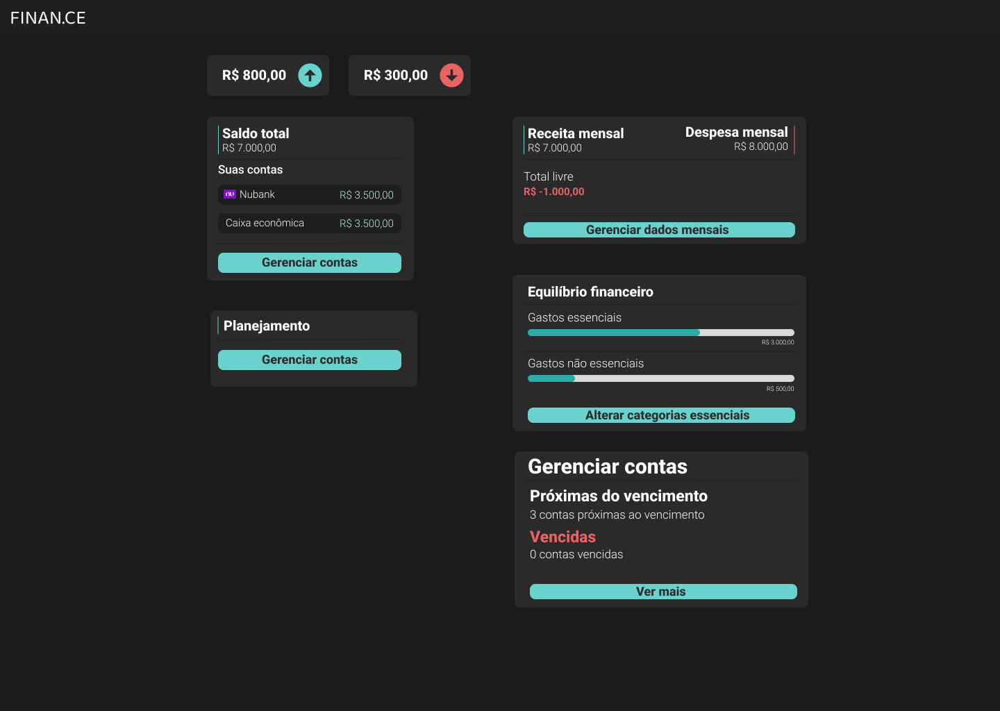
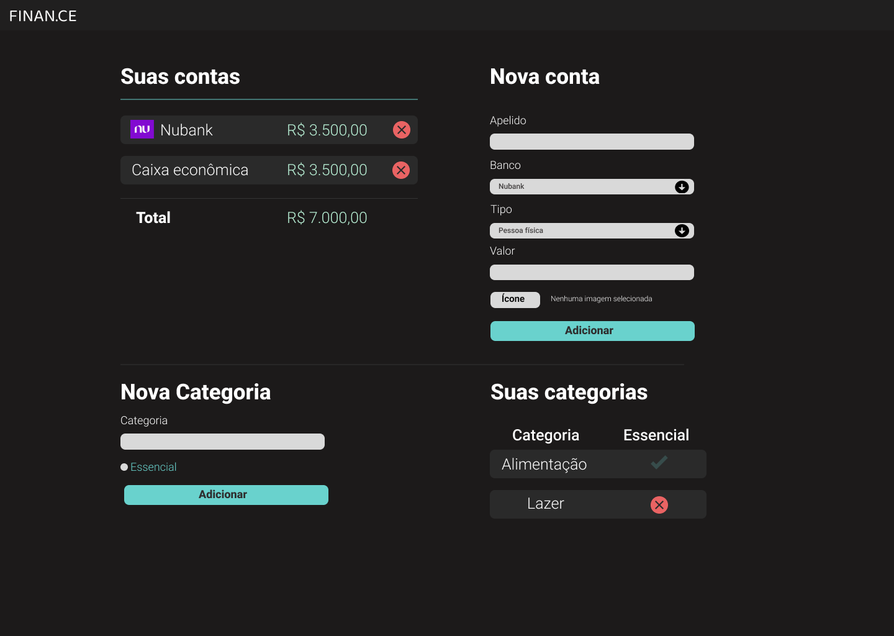
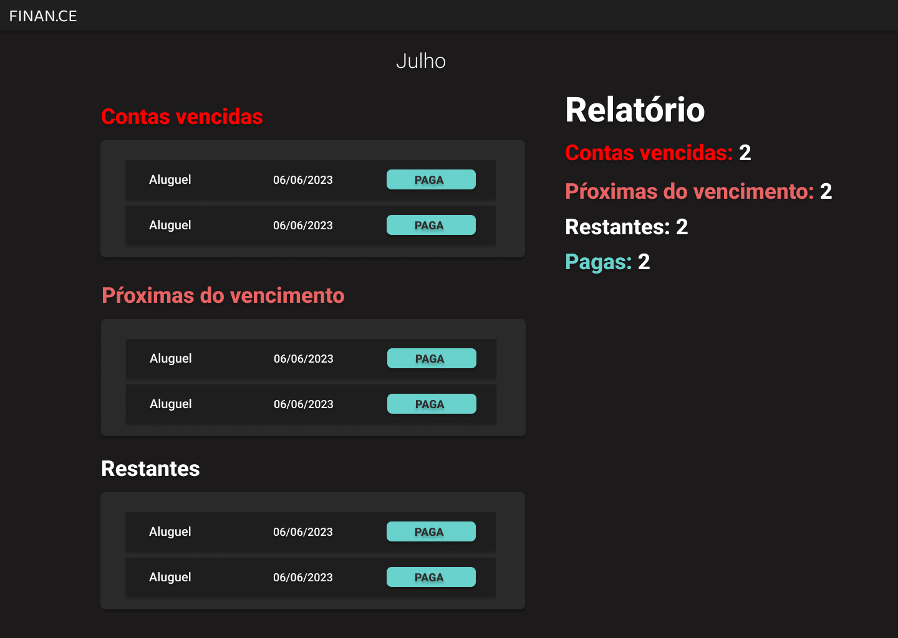

<h1 align="center"> Finance </h1>

  O projeto "Finance" é uma aplicação desenvolvida utilizando o framework Django, que tem como objetivo fornecer uma solução para gestão financeira pessoal. O sistema permite que os usuários gerenciem suas finanças, controlando despesas, receitas e orçamentos.

  <a href="#-tecnologias">Tecnologias</a>&nbsp;&nbsp;&nbsp;|&nbsp;&nbsp;&nbsp;
  <a href="#-projeto">Projeto</a>&nbsp;&nbsp;&nbsp;|&nbsp;&nbsp;&nbsp;
  <a href="#-layout">Layout</a>&nbsp;&nbsp;&nbsp;|&nbsp;&nbsp;&nbsp;
  <a href="#memo-licença">Licença</a>

  

 

## Página inicial

  Controle de orçamentos: O sistema permite que os usuários estabeleçam orçamentos mensais ou semanais para categorias específicas de despesas, auxiliando-os a manter um controle mais efetivo dos gastos e a identificar onde podem economizar.

  

## Contas

  Registro de despesas e receitas: Os usuários podem adicionar, editar e excluir despesas e receitas em categorias definidas, como alimentação, moradia, transporte, salário, entre outras. Cada registro pode conter informações como valor, dados, descrição e categoria.

  

## Relatórios

  Relatórios e gráficos: O projeto oferece recursos de geração de relatórios e gráficos para visualizar as despesas e receitas ao longo do tempo. Essas visualizações podem ajudar os usuários a analisar seus hábitos financeiros e identificar padrões de gastos.

  

## 🚀 Tecnologias

Esse projeto foi desenvolvido com as seguintes tecnologias:

- HTML, CSS
- Python, Django, Pytest
- Git, figma

## 💻 Projeto

## 🔖 Layout

Você pode visualizar o layout do projeto através [DESSE LINK](https://www.figma.com/file/ymc6wEkOQQtyd4eRBa7ZJ6/psw-7.0-(Copy)?type=design&node-id=0-1&mode=design&t=4LcxuA9SDSoi3RTa-0). É necessário ter conta no [Figma](https://figma.com) para acessá-lo.

## :memo: Licença

Esse projeto está sob a licença MIT.